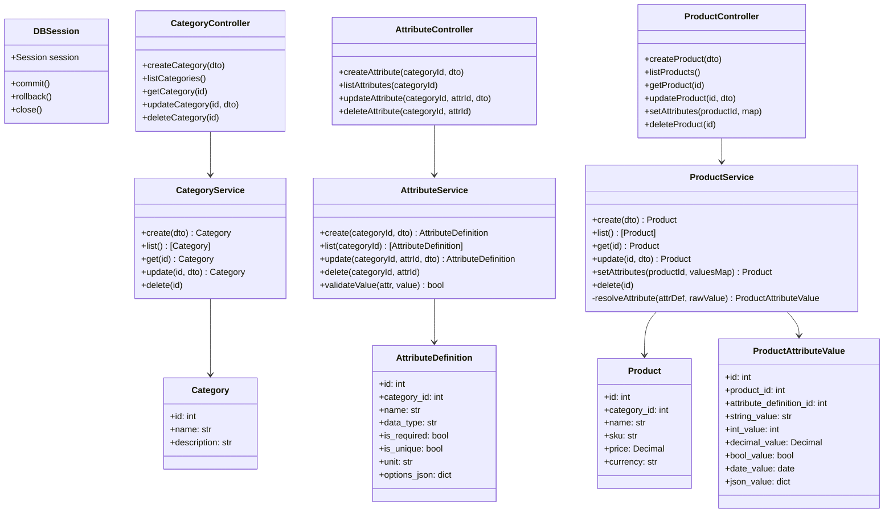

# Class Diagram

```mermaid
classDiagram
    class DBSession {
        +Session session
        +commit()
        +rollback()
        +close()
    }

    class CategoryController {
        +createCategory(dto)
        +listCategories()
        +getCategory(id)
        +updateCategory(id, dto)
        +deleteCategory(id)
    }

    class AttributeController {
        +createAttribute(categoryId, dto)
        +listAttributes(categoryId)
        +updateAttribute(categoryId, attrId, dto)
        +deleteAttribute(categoryId, attrId)
    }

    class ProductController {
        +createProduct(dto)
        +listProducts()
        +getProduct(id)
        +updateProduct(id, dto)
        +setAttributes(productId, map)
        +deleteProduct(id)
    }

    class CategoryService {
        +create(dto) Category
        +list() [Category]
        +get(id) Category
        +update(id, dto) Category
        +delete(id)
    }

    class AttributeService {
        +create(categoryId, dto) AttributeDefinition
        +list(categoryId) [AttributeDefinition]
        +update(categoryId, attrId, dto) AttributeDefinition
        +delete(categoryId, attrId)
        +validateValue(attr, value) bool
    }

    class ProductService {
        +create(dto) Product
        +list() [Product]
        +get(id) Product
        +update(id, dto) Product
        +setAttributes(productId, valuesMap) Product
        +delete(id)
        -resolveAttribute(attrDef, rawValue) ProductAttributeValue
    }

    class Category {
        +id: int
        +name: str
        +description: str
    }

    class AttributeDefinition {
        +id: int
        +category_id: int
        +name: str
        +data_type: str
        +is_required: bool
        +is_unique: bool
        +unit: str
        +options_json: dict
    }

    class Product {
        +id: int
        +category_id: int
        +name: str
        +sku: str
        +price: Decimal
        +currency: str
    }

    class ProductAttributeValue {
        +id: int
        +product_id: int
        +attribute_definition_id: int
        +string_value: str
        +int_value: int
        +decimal_value: Decimal
        +bool_value: bool
        +date_value: date
        +json_value: dict
    }

    CategoryController --> CategoryService
    AttributeController --> AttributeService
    ProductController --> ProductService

    CategoryService --> Category
    AttributeService --> AttributeDefinition
    ProductService --> Product
    ProductService --> ProductAttributeValue
```
