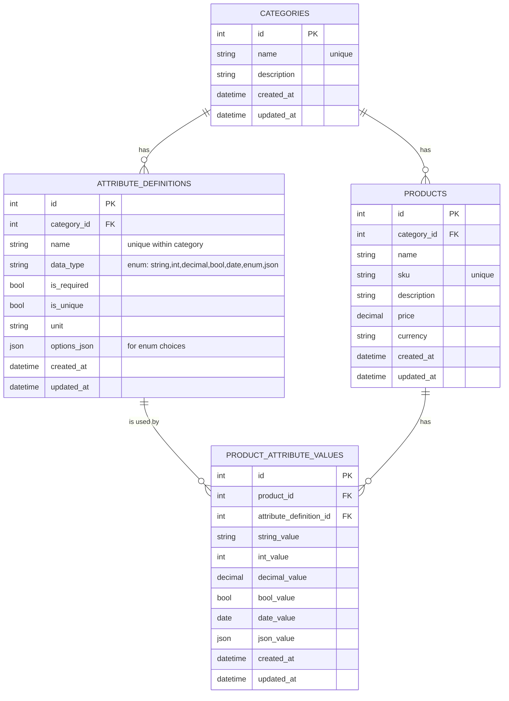

# ERD — Internal Product Management Tool

```mermaid
erDiagram
    CATEGORIES ||--o{ ATTRIBUTE_DEFINITIONS : "has"
    CATEGORIES ||--o{ PRODUCTS : "has"
    ATTRIBUTE_DEFINITIONS ||--o{ PRODUCT_ATTRIBUTE_VALUES : "is used by"
    PRODUCTS ||--o{ PRODUCT_ATTRIBUTE_VALUES : "has"

    CATEGORIES {
        int id PK
        string name "unique"
        string description
        datetime created_at
        datetime updated_at
    }

    ATTRIBUTE_DEFINITIONS {
        int id PK
        int category_id FK
        string name "unique within category"
        string data_type "enum: string,int,decimal,bool,date,enum,json"
        bool is_required
        bool is_unique
        string unit
        json options_json "for enum choices"
        datetime created_at
        datetime updated_at
    }

    PRODUCTS {
        int id PK
        int category_id FK
        string name
        string sku "unique"
        string description
        decimal price
        string currency
        datetime created_at
        datetime updated_at
    }

    PRODUCT_ATTRIBUTE_VALUES {
        int id PK
        int product_id FK
        int attribute_definition_id FK
        string string_value
        int int_value
        decimal decimal_value
        bool bool_value
        date date_value
        json json_value
        datetime created_at
        datetime updated_at
    }
```
